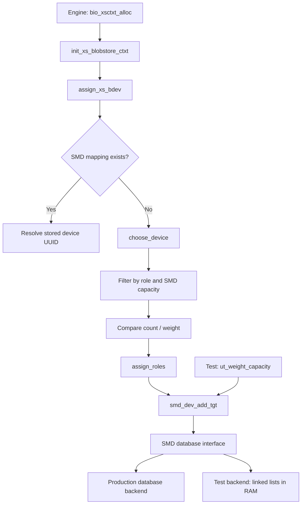

# Reading SMD tests and BIO device assignment

This guide explains `smd_ut.c` and `bio_xstream.c` at source snapshot **046caab85**. The first is a test program; the second is production code that initializes and manages BIO execution-stream storage contexts. The walkthroughs describe the code as it exists, including limitations and existing TODOs.

## Choose a reading path

| Document | What it contains |
| --- | --- |
| [smd_ut.c walkthrough](smd-ut-walkthrough.md) | All 603 source lines: in-memory database, setup/teardown, existing device/pool/replacement tests, and the added capacity regression. |
| [bio_xstream.c walkthrough](bio-xstream-walkthrough.md) | All 2,235 source lines: global initialization, SPDK callbacks, device creation, weights, role assignment, ownership, shutdown, and hotplug. |

Each walkthrough has a function index, explanations keyed to source lines, and expandable numbered source excerpts. Multi-line calls, related declarations, and repeated boilerplate are explained together. Blank lines and braces are retained in the excerpts so you can follow the original file without guessing where code was omitted. Links to GitHub use the fixed commit, so their line numbers remain valid if the branch changes.

For the weighting change, this order is easier than reading the large BIO file from the top:

1. Read the roles and counters below.
2. Read [`ut_weight_capacity()`](smd-ut-walkthrough.md#l508) to understand the failure the regression targets.
3. Read [`assign_xs_bdev()`](bio-xstream-walkthrough.md#l1485): existing mapping versus new assignment.
4. Read [`choose_device()`](bio-xstream-walkthrough.md#l1340): role eligibility, capacity, and weight comparison.
5. Read [`assign_roles()`](bio-xstream-walkthrough.md#l1419): where mappings are actually written.
6. Read [`validate_bio_weights()`](bio-xstream-walkthrough.md#l1092) and [`create_bio_bdev()`](bio-xstream-walkthrough.md#l949): how the configuration reaches the selector.
7. Read [`bio_xsctxt_alloc()`](bio-xstream-walkthrough.md#l1828): the caller connecting these operations.

## Objects, targets, devices, and roles

A **target** is a DAOS execution/storage unit identified by a target ID within an engine. A **device** is a storage backend known to SPDK and BIO. Several targets may share a device. A target can use separate devices for different storage roles.

| Role | Purpose | SMD enum value | Device bit mask |
| --- | --- | --- | --- |
| DATA | Application data on block storage | `SMD_DEV_TYPE_DATA = 0` | `NVME_ROLE_DATA = 1` (`001`) |
| META | Persistent metadata for the local store, including the structures organizing records | `SMD_DEV_TYPE_META = 1` | `NVME_ROLE_META = 2` (`010`) |
| WAL | Write-ahead log used by the storage recovery machinery | `SMD_DEV_TYPE_WAL = 2` | `NVME_ROLE_WAL = 4` (`100`) |

`SMD_DEV_TYPE_MAX = 3` is a loop/array bound, **not another role**. The enum chooses a role-indexed array or SMD table; the bit mask describes which roles a device supports.

For example:

```c
roles = NVME_ROLE_DATA | NVME_ROLE_META | NVME_ROLE_WAL;  /* 1 | 2 | 4 = 7 */
is_role_match(roles, NVME_ROLE_META);                    /* 7 & 2 != 0 */
```

The `|` operator combines role bits; `&` tests overlapping bits. `smd_dev_type2role(st)` converts the enum value into its mask. Do not use enum DATA=0 as a role mask: a zero mask has a special legacy meaning in `is_role_match()`—DATA-only.

**SMD versus META:** SMD is the server metadata service recording device identities, target/role assignments, and pool/blob mappings. META is one storage role. They are related parts of the system, but the SMD table is not the application's entire metadata store.

**System target:** `BIO_SYS_TGT_ID` is 1024 in this source. It represents the internal system/RDB use of storage, not an extra storage role or a count of available targets. The capacity test inserts one META mapping for it to demonstrate that internal mappings consume SMD slots too. It does not simulate every mapping made during real system-target initialization.

## How the two files connect



The test executes SMD insertion/query logic with its own backend. It does **not** call `choose_device()` or launch `bio_xsctxt_alloc()`. The shared `bio_weight_fits()` helper is tested directly using SMD-generated counts.

The startup call chain validates weights before `init_bio_bdevs()` opens/creates initial blobstores. The ordinary `bio_nvme_poll()` path drives I/O completion and monitoring; it does not recompute target weights per I/O.

## Three counters you must keep separate

| Field/concept | What it counts | Why it matters |
| --- | --- | --- |
| `sdi_tgt_cnt` | Entries in an SMD device record, including one entry per role mapping and system-target entries | Enforces the persistent 64-entry limit. |
| `bb_tgt_cnt` | Cached balancing count, initially seeded from SMD; normal-target role assignments increment it, while new system-target assignments do not | Supplies the numerator in weighted selection. It is not a reliable capacity counter. |
| `bb_ref` | Execution-stream references to the in-memory shared BIO blobstore wrapper | Prevents unloading/freeing a store while other contexts still use it. |

A subtle detail: because `bb_tgt_cnt` is initially seeded from the full SMD count, existing system entries can be included in that seed after restart. Saying it “always excludes system targets” would be too strong. The code specifically omits their **new increments** in `assign_roles()`.

Similarly, `cca_inflights` counts unfinished asynchronous callbacks and `bxb_blob_rw` counts pending blob I/O. Neither is a target or mapping-slot count.

## Work through the capacity test

The SMD device table has room for 64 mapping entries in this source. If a device supports all three roles, one ordinary target assigned to it records:

```text
(target 1000, DATA) -> device A
(target 1000, META) -> device A
(target 1000, WAL)  -> device A
```

That is **three entries**, even though the target ID is the same.

| Step in `ut_weight_capacity()` | Stored entries | Expected result |
| --- | --- | --- |
| Start with a new device UUID | 0 | Nothing has been inserted yet. |
| Insert targets 1000–1020 for each of three roles | 63 | All 63 SMD insertion calls succeed. |
| Ask if another three-role assignment fits | 63 | False: only one slot remains. |
| Ask if another two-role assignment fits | 63 | False. |
| Ask if a one-role assignment fits | 63 | True. |
| Insert one META mapping for system target 1024 | 64 | Insertion succeeds. |
| Ask if one more entry fits | 64 | False. |
| Directly attempt target 1021/DATA insertion | 64 | SMD returns `-DER_OVERFLOW`. |
| Query target 1021/DATA | 64 | `-DER_NONEXIST`: the rejected mapping was not inserted. |
| Query target 1000/WAL | 64 | Still resolves to the same device UUID. |

The high target IDs are synthetic test identifiers chosen to avoid the earlier tests' IDs. They do not allocate 1,021 physical targets or create an SSD.

The helper is:

```c
return needed > 0 && used <= limit && needed <= limit - used;
```

Read it left to right:

1. Reject an assignment that requests zero slots.
2. Reject an already-out-of-range occupancy.
3. Compare the request with remaining slots. Because `&&` short-circuits, subtraction is evaluated only after `used <= limit`, avoiding unsigned underflow. Subtraction also avoids overflowing `used + needed`.

This is a **predicate**, not a reservation. It does not modify SMD or lock anything. On the shown engine initialization path, the surrounding `bio_xsctxt_alloc()` mutex serializes selection and assignment.

## Work through weighted selection

The policy uses:

```text
score = runtime mapping count / device weight
```

For device A with weight 2 and device B with weight 1, assuming DATA-only roles, sufficient SMD capacity, and A first in the device list:

| New target | Counts before (A, B) | Scores before (A, B) | Choice | Counts after |
| --- | --- | --- | --- | --- |
| 1 | 0, 0 | 0, 0 | A wins the tie | 1, 0 |
| 2 | 1, 0 | 0.5, 0 | B | 1, 1 |
| 3 | 1, 1 | 0.5, 1 | A | 2, 1 |
| 4 | 2, 1 | 1, 1 | A wins the tie | 3, 1 |
| 5 | 3, 1 | 1.5, 1 | B | 3, 2 |
| 6 | 3, 2 | 1.5, 2 | A | 4, 2 |

The implementation avoids floating point and division:

```c
(uint64_t)count * best_weight < (uint64_t)best_count * weight
```

For positive weights, cross-multiplication compares the same two ratios. Casting **before** multiplication ensures the product is computed in 64 bits. A strict `<` retains the earlier device on a tie.

Role and capacity checks happen before this comparison. For example, a weight-65535 device with 63 slots occupied cannot receive a three-role assignment. A lower-weight eligible device with enough free slots may receive it instead.

The weight is currently one integer per device. DATA, META, and WAL do not have independent measured-throughput profiles in this patch. Consequently, mixing devices with different role combinations is not a calibrated load model.

## What the asynchronous code is doing

Several SPDK functions submit work and return before it is finished. A typical pattern in `bio_xstream.c` is:

```text
common_prep_arg: pending=1, status=0
    |
Submit SPDK operation with a callback and pointer to that state
    |
xs_poll_completion repeatedly calls spdk_thread_poll
    |
Callback stores status/result and decrements pending to 0
    |
The waiting wrapper returns the operation's result
```

The BIO wrapper can therefore look synchronous while the underlying SPDK operation is asynchronous. The callback context must remain alive until completion. A stack-local `common_cp_arg` is used only while the wrapper stays in the polling call; the JSON initialization context is heap-allocated and freed by the final callback.

An SPDK thread is a logical SPDK execution/message context; seeing `spdk_thread_create()` does not mean this function directly creates a dedicated POSIX thread for every call. In this integration DAOS drives it through polling.

## C and DAOS glossary

| Code | How to read it |
| --- | --- |
| `p->field` | Access a structure member through pointer `p`. |
| `&value` | Address of a variable, often used as an output argument. |
| `*out = result` | Write through an output pointer into the caller's variable. |
| `struct type **out` | Pointer to the caller's pointer; permits returning an allocated object. |
| `void *arg` | Opaque callback context; cast back to the expected structure before using it. |
| `static` on a file-scope function | This function is internal to this C translation unit. |
| `static` on a local variable | Keep the variable's value between calls, as with the hotplug scan period. |
| `inline` | Allows inlining; it does not guarantee a separate runtime thread or asynchronous execution. |
| `if (rc)` | Nonzero return code, usually an error for these APIs. Check the individual API: the role parser and weight iterator also use positive values as results. |
| `!pointer` / `pointer == NULL` | No object/result. The async blobstore wrapper deliberately returns NULL immediately, so context matters. |
| `a && b`, `a \|\| b` | Short-circuit Boolean operations: the right-hand expression may not execute. |
| `condition ? yes : no` | Choose one of two expressions based on the condition. |
| `continue` / `break` | Skip to the next loop iteration / leave the loop. |
| `goto out` | Jump to a cleanup label, usually releasing resources shared by several failure paths. |
| `D_GOTO(error, rc = ...)` | DAOS macro combining a status assignment with a jump to cleanup. |
| `D_ALLOC_PTR(p)` | Allocate zero-initialized storage for the object pointed to by `p`; check for NULL afterward. |
| `D_ALLOC_ARRAY(p, n)` | Allocate an array of `n` elements of the pointed-to type. |
| `D_FREE(p)` | DAOS deallocation helper; releases the allocated object. It does not erase on-disk/SMD records. |
| `D_STRNDUP` | Create an owned copy of a string up to the requested length. |
| `D_ASSERT(expr)` | Internal invariant check; false means a programming/state assumption was violated. |
| `assert_rc_equal(rc, expected)` | cmocka test assertion checking the actual return code against the expected outcome. |
| `assert_int_equal(a, b)` | Test assertion requiring equal integer values. |
| `uuid_compare(a, b) == 0` | UUID byte sequences are equal. |
| `strcmp(a, b) == 0` | NUL-terminated strings are equal. |
| `memcmp(a, b, n) == 0` | The first `n` bytes are equal, even if they are not strings. |
| `memcpy(dst, src, n)` | Copy `n` bytes; destination ownership/capacity is the caller's responsibility. |
| `d_iov_t` | Buffer pointer and lengths describing a key or value passed to the database interface. |
| `container_of` / `d_list_entry` | Recover the enclosing structure from the address of one embedded member/list node. |
| `D_INIT_LIST_HEAD` | Initialize an empty intrusive doubly linked list. |
| `d_list_for_each_entry_safe` | Iterate while permitting removal of the current list item; a temporary remembers the next item. |
| `d_list_del_init` | Unlink a node and reset it to an empty/self-linked state. |
| `ABT_mutex_lock` | Serialize access using an Argobots mutex. |
| `ABT_cond_wait` | Wait on a condition, releasing the associated mutex while waiting and reacquiring it before returning. |
| `spdk_thread_send_msg` | Queue a callback on a particular SPDK thread; the sender does not directly execute its work. |
| `DF_UUID`, `DP_UUID`, `DF_RC`, `DP_RC` | DAOS printf-style format/argument helpers for IDs and error diagnostics. Adjacent C string literals concatenate. |

Common outcomes in these files:

| Status | Meaning in the tested paths |
| --- | --- |
| `0` | Success. |
| `-DER_EXIST` | Duplicate/existing mapping. |
| `-DER_NONEXIST` | Requested mapping or record not found. |
| `-DER_INVAL` | Invalid argument, configuration, state, or incompatible record data. |
| `-DER_OVERFLOW` | This test's insertion exceeds the SMD table limit. |
| `-DER_NOMEM` | Allocation failure; some wrapper paths also report this for a failed resource acquisition. |
| `-DER_TIMEDOUT` | An asynchronous completion was not observed before the timeout. |

## What the tests prove, and what they do not

`ut_weight_capacity()` exercises actual SMD insertion and lookup routines with an in-memory backend. It checks role-entry accounting, the capacity predicate, hard-limit rejection, and preservation of older mappings after that rejection. The pure policy tests separately check parsing, ratio comparisons, and simulated target distributions.

Neither suite launches a full engine or proves restart durability. The linked-list backend provides no durable transaction/rollback implementation. The tests also do not prove that live `choose_device()` always selects the right device under every role/hotplug/restart scenario; those require additional integration coverage.

`assign_roles()` has a TODO for undoing earlier role assignments if a later insertion fails. The new guard checks that all intended roles fit **before** assignment, which avoids this predictable capacity failure midway through one assignment. It does not add an all-role transaction or a whole-engine allocation preflight.

Most lifecycle, callback, and hotplug code in `bio_xstream.c` is preexisting. A successful explanation of those paths should not be confused with new tests for them.
